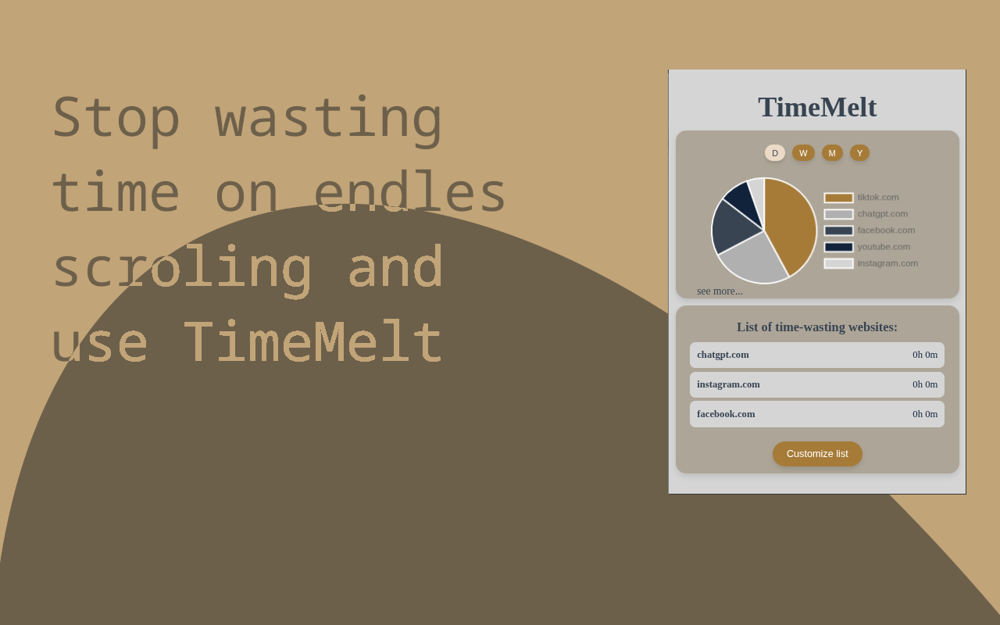

# TimeMelt - Digital Detox Clock

A Chrome browser extension that helps you monitor and analyze the time spent on websites that "melt" your time, supporting better time management and digital detox.

---

## Table of Contents

- [Features](#features)
- [Installation](#installation)
- [Usage](#usage)
- [Screenshots](#screenshots)
- [Contributing](#contributing)
- [License](#license)

---

## Features

*   **Time Tracking:** Monitors the time spent on defined websites, helping you identify where your time is going.
*   **Data Visualization:** Presents time spent data in a clear pie chart, providing a quick overview of your activity.
*   **Period Filtering:** Allows you to view data by different periods: daily, weekly, monthly, and yearly, enabling trend analysis.
*   **Website List:** Displays a list of websites where you spend the most time, with a summary of time for each.
*   **List Customization:** Easily add new domains to the list of monitored "time-wasters" and remove existing ones.
*   **Detailed View:** Access detailed data on time spent on each website per day, allowing for in-depth analysis.

---

## Installation

To install the TimeMelt extension in your Chrome browser, choose your preferred method:

### Option 1: Install from Chrome Web Store (Recommended)

This is the easiest way to install TimeMelt and receive automatic updates.

1.  Visit the [TimeMelt - Digital Detox Clock page on the Chrome Web Store](LINK_DO_CHROME_WEB_STORE_TUTAJ).
2.  Click the "Add to Chrome" button.
3.  Follow the on-screen prompts to confirm the installation.

### Option 2: Manual Installation (For developers or advanced users)

If you prefer to install the extension directly from the source code (e.g., for development or testing pre-release versions), follow these steps:

1.  **Download Files**:
    * **From Releases**: Go to the [Releases](https://github.com/YOUR_USERNAME/TimeMelt/releases) section of this repository and download the latest `TimeMelt-DigitalDetoxClock.zip` file (or similar name) from the assets of the desired release. Unzip the downloaded file to a location on your computer.
    * **Or Clone Repository**: `git clone https://github.com/YOUR_USERNAME/TimeMelt.git` or download the files as a ZIP archive and extract them.
2.  **Open Extensions Management**: In your Chrome browser, type `chrome://extensions/` in the address bar and press Enter.
3.  **Enable Developer Mode**: In the top right corner of the page, toggle on "Developer mode".
4.  **Load Extension**: Click the "Load unpacked" button in the top left corner and select the folder where you extracted the extension files (either from the unzipped release or the cloned repository).

The "TimeMelt - Digital Detox Clock" extension should appear in your list of installed extensions and be ready to use.

---

## Usage

After installing the extension:

1.  **Open Popup:** Click the TimeMelt extension icon in the Chrome toolbar.
2.  **View Data:** The popup window will show a chart displaying the time spent on monitored websites for the selected period (default is today).
3.  **Change Period:** Use the **D** (Day), **W** (Week), **M** (Month), **Y** (Year) buttons to change the reporting period for the chart and list.
4.  **Website List:** Below the chart is a list of websites where you spend the most time, with a summary.
5.  **Customize List:** Click the **"Customize list"** button to go to the view for managing the list of monitored websites. Here you can **"Add"** new domains or **"Delete"** existing ones.
6.  **Detailed Data:** Click the **"see more..."** link below the chart to see a detailed table with data on time spent on individual websites for the selected period, broken down by day.

---

## Screenshots

---

## Contributing

All suggestions, bug reports, and contributions to the project are welcome!

1.  Fork the repository.
2.  Create a new branch (`git checkout -b feature/new-feature-name`).
3.  Commit your changes (`git commit -am 'Add new feature'`).
4.  Push to the branch (`git push origin feature/new-feature-name`).
5.  Open a Pull Request.

---

## License

This project is licensed under the MIT License. See the [LICENSE](LICENSE) file (if available in the repository) for details.

---
